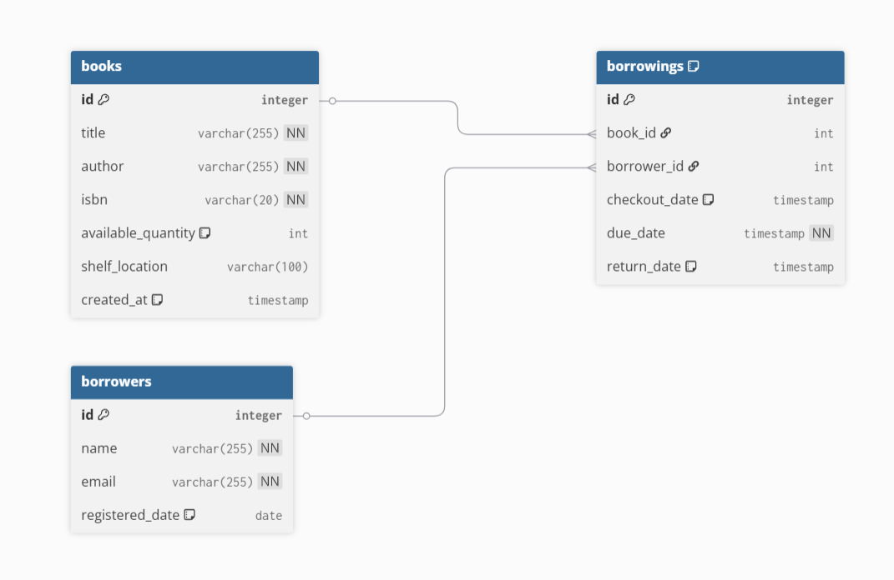

# 📚 Library Management System API

A professional, production-ready RESTful API for managing library operations built with Node.js, Express, and PostgreSQL.

---

## 📑 Table of Contents

- [Features](#-features)
- [Quick Start](#-quick-start)
- [Database Schema](#️-database-schema)
- [API Endpoints](#-api-endpoints)
- [Detailed API Documentation](#-detailed-api-documentation)
- [Security Features](#-security-features)
- [Postman Collection & Testing](#-postman-collection--api-testing)
- [Testing](#-testing)
- [Project Structure](#️-project-structure)
- [Assessment Compliance](#-assessment-compliance)

---

## ✨ Features

### Core Functionality

- **Book Management**: Add, update, delete, search, and list books with ISBN validation
- **Borrower Management**: Register and manage borrower accounts
- **Borrowing Operations**: Complete checkout/return workflow with due date tracking
- **Overdue Tracking**: Automatic monitoring of overdue books
- **Analytics & Reporting**: Export borrowing data in CSV/XLSX formats

### Security & Performance

- 🔐 **JWT Authentication**: Secure token-based authentication
- 🛡️ **Helmet.js Integration**: Enhanced security headers protection
- 💉 **SQL Injection Prevention**: Parameterized queries using `$1, $2, ...` notation
- ⚡ **Database Indexing**: Optimized read operations on frequently queried fields
- 🚦 **Rate Limiting**: API abuse prevention on critical endpoints
- ✅ **Input Validation**: Comprehensive request validation

---

## 🚀 Quick Start

### Prerequisites

- Node.js (v14+)
- PostgreSQL (v12+)
- Docker & Docker Compose (optional)

### Option 1: Docker Setup (Recommended)

```bash
# Clone the repository
git clone https://github.com/hazemmx/Library-Management-API.git
cd Library-Management-API

# Start the application with Docker Compose
docker-compose up -d

# Seed the database with sample data (optional but recommended)
npm run seed


# The API will be available at http://localhost:3005
```

### Option 2: Manual Setup

```bash
# 1. Clone the repository
git clone https://github.com/hazemmx/Library-Management-API.git
cd Library-Management-API

# 2. Install dependencies
npm install

# 3. Set up environment variables
cp .env.example .env
# Edit .env with your database credentials

# 4. Create database and run migrations
psql -U postgres -f database/schema.sql

# 5. Seed the database with sample data (optional but recommended)
npm run seed


# 6. Start the server
npm start
```

---

## 🗄️ Database Schema

The following diagram illustrates the normalized relational structure of the library system, including books, borrowers, and borrowings.



🔗 **Interactive Diagram:**  
https://dbdiagram.io/d/library-management-697dd68cbd82f5fce23419f7

The system uses a normalized PostgreSQL schema with the following tables:

### Tables

- **books**: Book inventory with ISBN, title, author, quantity, and shelf location
- **borrowers**: Registered library users
- **borrowings**: Tracks checkout/return transactions with due dates

### Key Indexes (Performance Optimization)

```sql
-- Books table
CREATE INDEX idx_books_title ON books(title);
CREATE INDEX idx_books_author ON books(author);
CREATE INDEX idx_books_isbn ON books(isbn);

-- Borrowers table
CREATE INDEX idx_borrowers_email ON borrowers(email);

-- Borrowings table
CREATE INDEX idx_borrowings_status ON borrowings(status);
CREATE INDEX idx_borrowings_due_date ON borrowings(due_date);
CREATE INDEX idx_borrowings_borrower_id ON borrowings(borrower_id);
```

**See detailed schema:** [`database/schema.sql`](database/schema.sql)

---

## 🔌 API Endpoints

### Authentication

| Method | Endpoint               | Description                 | Rate Limited |
| ------ | ---------------------- | --------------------------- | ------------ |
| POST   | `/api/borrowers`       | Register new borrower       | ❌           |
| POST   | `/api/borrowers/login` | Login and receive JWT token | ✅           |

### Books (Public Access)

| Method | Endpoint            | Description                       | Auth Required |
| ------ | ------------------- | --------------------------------- | ------------- |
| GET    | `/api/books`        | List all books                    | ❌            |
| POST   | `/api/books/search` | Search books by title/author/ISBN | ❌            |
| POST   | `/api/books`        | Add new book                      | ❌            |
| PUT    | `/api/books/:id`    | Update book details               | ❌            |
| DELETE | `/api/books/:id`    | Delete book                       | ❌            |

### Borrowers (Public Access)

| Method | Endpoint             | Description          | Auth Required |
| ------ | -------------------- | -------------------- | ------------- |
| GET    | `/api/borrowers`     | List all borrowers   | ❌            |
| PUT    | `/api/borrowers/:id` | Update borrower info | ❌            |
| DELETE | `/api/borrowers/:id` | Delete borrower      | ❌            |

### Borrowing Operations (🔒 Protected)

| Method | Endpoint                     | Description              | Auth Required |
| ------ | ---------------------------- | ------------------------ | ------------- |
| POST   | `/api/borrowings/checkout`   | Checkout a book          | ✅            |
| POST   | `/api/borrowings/return/:id` | Return a book            | ✅            |
| GET    | `/api/borrowings/my-books`   | Get user's current books | ✅            |
| GET    | `/api/borrowings/overdue`    | List overdue books       | ❌            |

### Analytics & Reports (Public Access)

| Method | Endpoint                                         | Description           | Auth Required |
| ------ | ------------------------------------------------ | --------------------- | ------------- |
| GET    | `/api/reports/borrowings?start=&end=&format=csv` | Export borrowing data | ❌            |
| GET    | `/api/reports/overdue?format=xlsx`               | Export overdue books  | ❌            |

> **Note:** Authentication is strategically implemented on core borrowing operations (checkout, return, my-books) to demonstrate JWT implementation and protected resource access. This design choice shows the capability to secure sensitive operations while keeping public endpoints accessible for browsing.

### Quick API Reference

**Base URL:** `http://localhost:3005/api`

**Authentication Header:**

```
Authorization: Bearer {your_jwt_token}
```

**Common Response Codes:**

- `200` OK - Request successful
- `201` Created - Resource created successfully
- `400` Bad Request - Validation error
- `401` Unauthorized - Authentication required/failed
- `404` Not Found - Resource not found
- `429` Too Many Requests - Rate limit exceeded
- `500` Internal Server Error - Server error

**Response Format:** All responses follow this structure:

```json
{
  "success": true/false,
  "message": "Details",         // Optional, usually on success
  "data": { ... },              // On success
  "error": "Error type",        // On failure
  "pagination": { ... }         // Only for list endpoints
}
```

📖 **For detailed request/response examples, see [Detailed API Documentation](#-detailed-api-documentation) or use the [Postman Collection](#-postman-collection--api-testing)**

---

## 🔒 Security Features

### 1. **Parameterized Queries**

All database queries use PostgreSQL parameterized syntax to prevent SQL injection:

```javascript
// ✅ SECURE - Using $1, $2 parameters
const result = await pool.query(
  "SELECT * FROM books WHERE title = $1 AND author = $2",
  [title, author],
);

// ❌ INSECURE - Never used in this project
const result = await pool.query(`SELECT * FROM books WHERE title = '${title}'`);
```

### 2. **Helmet.js Security Headers**

Automatically sets secure HTTP headers:

- Content Security Policy
- X-Frame-Options (clickjacking protection)
- X-Content-Type-Options (MIME sniffing prevention)
- Strict-Transport-Security (HTTPS enforcement)

### 3. **JWT Authentication**

- Stateless authentication using JSON Web Tokens
- Secure email-based authentication
- Token expiration and refresh mechanisms

### 4. **Rate Limiting**

Protected endpoints:

- **Login**: 5 requests per 15 minutes per IP
- **Checkout**: 3 requests per 1 minute per user
- Prevents brute force attacks

---

## 📖 Detailed API Documentation

### Authentication Endpoints

#### Register Borrower

```http
POST /api/borrowers
Content-Type: application/json
```

**Request Body:**

```json
{
  "name": "John Doe",
  "email": "john@example.com"
}
```

**Response (201 Created):**

```json
{
  "success": true,
  "message": "Borrower registered successfully",
  "data": {
    "id": 1,
    "name": "John Doe",
    "email": "john@example.com",
    "registered_date": "2025-01-31T10:00:00.000Z"
  }
}
```

**Error Response (400 Bad Request) - Email Already Exists:**

```json
{
  "success": false,
  "error": "Registration failed",
  "message": "This email is already taken"
}
```

**Error Response (400 Bad Request) - Validation Error:**

```json
{
  "success": false,
  "error": "Email is required"
}
```

---

#### Login (🚦 Rate Limited)

```http
POST /api/borrowers/login
Content-Type: application/json
```

**Rate Limit:** 5 requests per 15 minutes per IP address

**Request Body:**

```json
{
  "email": "john@example.com"
}
```

**Response (200 OK):**

```json
{
  "success": true,
  "message": "Login successful",
  "token": "eyJhbGciOiJIUzI1NiIsInR5cCI6IkpXVCJ9...",
  "data": {
    "id": 1,
    "name": "John Doe"
  }
}
```

**Error Response (401 Unauthorized):**

```json
{
  "success": false,
  "error": "Authentication failed",
  "message": "Borrower not found with this email"
}
```

**Error Response (429 Too Many Requests):**

```json
{
  "success": false,
  "error": "Too many requests",
  "message": "Too many login attempts. Please try again in 15 minutes"
}
```

---

### Book Endpoints

#### List All Books

```http
GET /api/books
```

**Query Parameters:**

- `page` (optional): Page number, default: 1
- `limit` (optional): Items per page, default: 5

**Response (200 OK):**

```json
{
  "success": true,
  "data": [
    {
      "id": 1,
      "title": "Clean Code",
      "author": "Robert C. Martin",
      "isbn": "978-0132350884",
      "available_quantity": 5,
      "shelf_location": "A-12",
      "created_at": "2025-01-31T10:00:00.000Z"
    },
    {
      "id": 2,
      "title": "The Pragmatic Programmer",
      "author": "Andrew Hunt",
      "isbn": "978-0201616224",
      "available_quantity": 3,
      "shelf_location": "A-13",
      "created_at": "2025-01-30T14:30:00.000Z"
    }
  ],
  "pagination": {
    "totalItems": 16,
    "totalPages": 4,
    "currentPage": 1,
    "pageSize": 5
  }
}
```

---

#### Search Books

```http
POST /api/books/search
Content-Type: application/json
```

**Request Body:**

```json
{
  "searchTerm": "clean code"
}
```

**Response (200 OK):**

```json
{
  "success": true,
  "data": [
    {
      "id": 1,
      "title": "Clean Code",
      "author": "Robert C. Martin",
      "isbn": "978-0132350884",
      "available_quantity": 5,
      "shelf_location": "A-12",
      "created_at": "2026-01-31T17:50:15.339Z"
    }
  ]
}
```

**Error Response (400 Bad Request):**

```json
{
  "success": false,
  "error": "Search term is required"
}
```

---

#### Add Book

```http
POST /api/books
Content-Type: application/json
```

**Request Body:**

```json
{
  "title": "Clean Code",
  "author": "Robert C. Martin",
  "isbn": "978-0132350884",
  "quantity": 5,
  "shelf_location": "A-12"
}
```

**Response (201 Created):**

```json
{
  "success": true,
  "message": "Book added successfully",
  "data": {
    "id": 1,
    "title": "Clean Code",
    "author": "Robert C. Martin",
    "isbn": "978-0132350884",
    "available_quantity": 5,
    "shelf_location": "A-12"
  }
}
```

**Error Response (400 Bad Request):**

```json
{
  "success": false,
  "error": "Validation failed",
  "message": "Missing required fields: title, author, and isbn are mandatory"
}
```

**Error Response (409 Conflict):**

```json
{
  "success": false,
  "error": "Duplicate Entry",
  "message": "Book with this ISBN already exists"
}
```

---

#### Update Book

```http
PUT /api/books/:id
Content-Type: application/json
```

**Request Body:** (All fields optional)

```json
{
  "title": "Clean Code: A Handbook",
  "quantity": 10,
  "shelf_location": "A-15"
}
```

**Response (200 OK):**

```json
{
  "success": true,
  "message": "Book updated successfully",
  "data": {
    "id": 1,
    "title": "Clean Code: A Handbook",
    "author": "Robert C. Martin",
    "isbn": "978-0132350884",
    "available_quantity": 10,
    "shelf_location": "A-15"
  }
}
```

**Error Response (400 Bad Request):**

```json
{
  "success": false,
  "error": "Update data is required"
}
```

---

#### Delete Book

```http
DELETE /api/books/:id
```

**Response (200 OK):**

```json
{
  "success": true,
  "message": "Book with ID 1 deleted successfully",
  "deletedAt": "2025-01-31T15:30:00.000Z"
}
```

**Error Response (500 Internal Server Error):**

```json
{
  "success": false,
  "error": "Deletion failed",
  "message": "Book Not Found"
}
```

---

### Borrower Endpoints

#### List All Borrowers

```http
GET /api/borrowers
```

**Query Parameters:**

- `page` (optional): Page number, default: 1
- `limit` (optional): Items per page, default: 10

**Response (200 OK):**

```json
{
  "success": true,
  "data": [
    {
      "id": 1,
      "name": "John Doe",
      "email": "john.doe@example.com",
      "registered_date": "2025-01-15T10:00:00.000Z"
    },
    {
      "id": 2,
      "name": "Jane Smith",
      "email": "jane.smith@example.com",
      "registered_date": "2025-01-20T14:30:00.000Z"
    }
  ],
  "pagination": {
    "totalItems": 45,
    "totalPages": 5,
    "currentPage": 1,
    "pageSize": 10
  }
}
```

---

#### Update Borrower

```http
PUT /api/borrowers/:id
Content-Type: application/json
```

**Request Body:** (All fields optional)

```json
{
  "name": "John Smith",
  "email": "john.smith@example.com"
}
```

**Response (200 OK):**

```json
{
  "success": true,
  "message": "Borrower updated successfully",
  "data": {
    "id": 1,
    "name": "John Smith",
    "email": "john.smith@example.com",
    "registered_date": "2025-01-15T10:00:00.000Z"
  }
}
```

**Error Response (400 Bad Request) - Email Already Taken:**

```json
{
  "success": false,
  "error": "Update failed",
  "message": "This email is already taken"
}
```

---

#### Delete Borrower

```http
DELETE /api/borrowers/:id
```

**Response (200 OK):**

```json
{
  "success": true,
  "message": "Borrower with ID 1 deleted successfully"
}
```

**Error Response (500 Internal Server Error):**

```json
{
  "success": false,
  "message": "Deletion failed: No borrower found with ID 412"
}
```

---

### Borrowing Endpoints (🔒 Authentication Required)

#### Checkout Book (🚦 Rate Limited)

```http
POST /api/borrowings/checkout
Authorization: Bearer {token}
Content-Type: application/json
```

**Rate Limit:** 3 checkouts per 1 minute per user

**Request Body:**

```json
{
  "book_id": 1
}
```

**Response (201 Created):**

```json
{
  "status": "success",
  "message": "Book checked out successfully",
  "data": {
    "id": 33,
    "book_id": 6,
    "borrower_id": 5,
    "checkout_date": "2026-02-01T00:27:21.304Z",
    "due_date": "2026-02-08T00:27:21.302Z",
    "return_date": null
  }
}
```

**Error Response (500 Internal Server Error):**

```json
{
  "success": "false",
  "message": "Failed to check out book",
  "error": "Book out of stock"
}
```

**Error Response (429 Too Many Requests):**

```json
{
  "success": false,
  "message": "You can only checkout 3 books per minute. Please wait before checking out more books.",
  "retryAfter": "60 seconds"
}
```

---

#### Return Book

```http
POST /api/borrowings/return/:borrowing_id
Authorization: Bearer {token}
```

**Response (200 OK):**

```json
{
 {
    "success": true,
    "message": "Book returned successfully",
    "data": {
        "message": "Book returned successfully"
    }
}
}
```

**Error Response (500 Internal Server Error):**

```json
{
  "success": false,
  "message": "Failed to return book",
  "error": "No active borrowing record found for this user and book ID."
}
```

---

#### User's Borrowings

```http
GET /api/borrowings/my-books
Authorization: Bearer {token}
```

**Response (200 OK):**

```json
{
  "success": true,
  "message": "Books retrieved successfully",
  "data": [
    {
      "title": "Clean Code",
      "author": "Robert C. Martin",
      "checkout_date": "2025-01-31T10:00:00.000Z",
      "due_date": "2025-02-14T10:00:00.000Z"
    }
  ]
}
```

**Response Error (401 Unauthorized):**

```json
{

  {
    "error":"Access denied. No token provided."
  }
}
```

**Response Error (404 Not Found):**

```json
{

  {
    "success": false,
    "message": "No books found for this user"
}
}
```

---

#### List Overdue Books

```http
GET /api/borrowings/overdue
```

**Response (200 OK):**

```json
{
  "success": true,
  "message": "Overdue books retrieved successfully",
  "data": [
    {
      "id": 17,
      "title": "1984",
      "borrower_name": "Emma Brown",
      "due_date": "2026-01-26T12:00:00.000Z"
    }
  ]
}
```

---

---

### Analytics & Reports

#### Export Borrowing Data

```http
GET /api/reports/export?start=2025-01-01&end=2025-01-31
```

**Description:** Export all borrowing records within a specified date range to an Excel file.

**Query Parameters:**

- `start` (required): Start date in YYYY-MM-DD format
- `end` (required): End date in YYYY-MM-DD format

**Example Request:**

```bash
curl -X GET "http://localhost:3005/api/reports/export?start=2025-01-01&end=2025-01-31" \
  --output borrowing_report.xlsx
```

**Response (200 OK):**

- Content-Type: `application/vnd.openxmlformats-officedocument.spreadsheetml.sheet`
- Returns downloadable XLSX file
- Filename: `Report_2025-01-01_to_2025-01-31.xlsx`

**Excel File Contents:**
| Borrowing ID | Book Title | Borrower Name | Checkout Date | Due Date | Return Date | Days Borrowed | Status |
|-------------|------------|---------------|---------------|----------|-------------|---------------|---------|
| 1 | Clean Code | John Doe | 2025-01-15 | 2025-01-29 | 2025-01-20 | 5 | Returned |
| 2 | The Pragmatic Programmer | Jane Smith | 2025-01-10 | 2025-01-24 | null | 21 | Borrowed |
| 3 | Design Patterns | Bob Johnson | 2025-01-05 | 2025-01-19 | 2025-01-18 | 13 | Returned |

**Error Response (404 Not Found) - No Records Found:**

```json
{
  "success": false,
  "error": "No records found",
  "message": "No borrowing records found for the specified date range"
}
```

**Error Response (400 Bad Request) - Invalid Date Format:**

```json
{
  "success": false,
  "error": "Invalid date format",
  "message": "Please provide dates in YYYY-MM-DD format"
}
```

**Error Response (400 Bad Request) - Missing Parameters:**

```json
{
  "success": false,
  "error": "Missing required parameters",
  "message": "Both start and end dates are required"
}
```

---

#### Export Last Month Overdue Books

```http
GET /api/reports/last-month-overdue
```

**Description:** Export all books that were overdue during the last month (past 30 days) to an Excel file. This report helps identify borrowers with overdue books and calculate late fees.

**Example Request:**

```bash
curl -X GET "http://localhost:3005/api/reports/last-month-overdue" \
  --output last_month_overdue.xlsx
```

**Response (200 OK):**

- Content-Type: `application/vnd.openxmlformats-officedocument.spreadsheetml.sheet`
- Returns downloadable XLSX file
- Filename: `Last_Month_Overdue_Report.xlsx`

**Excel File Contents:**
| Borrowing ID | Book Title | Borrower Name | Borrower Email | Checkout Date | Due Date | Days Overdue |
|-------------|------------|---------------|----------------|---------------|----------|--------------|
| 5 | Refactoring | Alice Williams | alice@example.com | 2024-12-20 | 2025-01-03 | 28 |
| 8 | Code Complete | Charlie Brown | charlie@example.com | 2024-12-25 | 2025-01-08 | 23 |
| 12 | Clean Architecture | David Lee | david@example.com | 2024-12-28 | 2025-01-11 | 20 |

**Report Criteria:**

- Only includes unreturned books (return_date IS NULL)
- Due date must be in the last month
- Due date must be before current timestamp (actually overdue)
- Sorted by due date (oldest overdue first)

**Error Response (404 Not Found) - No Overdue Books:**

```json
{
  "success": false,
  "error": "No records found",
  "message": "No overdue books found in the last month"
}
```

**Error Response (500 Internal Server Error):**

```json
{
  "success": false,
  "error": "Export failed",
  "message": "Failed to generate overdue report"
}
```

---

#### Export Last Month All Activity

```http
GET /api/reports/last-month-all
```

**Description:** Export all borrowing activity (checkouts, returns, and active borrowings) from the last month (past 30 days). Provides a comprehensive overview of library usage and activity trends.

**Example Request:**

```bash
curl -X GET "http://localhost:3005/api/reports/last-month-all" \
  --output last_month_activity.xlsx
```

**Response (200 OK):**

- Content-Type: `application/vnd.openxmlformats-officedocument.spreadsheetml.sheet`
- Returns downloadable XLSX file
- Filename: `Last_Month_All_Activity.xlsx`

**Excel File Contents:**
| Borrowing ID | Book Title | Borrower Name | Checkout Date | Due Date | Return Date | Days Borrowed | Status |
|-------------|------------|---------------|---------------|----------|-------------|---------------|---------|
| 15 | Clean Code | John Doe | 2025-01-15 | 2025-01-29 | 2025-01-20 | 5 | Returned |
| 16 | The Pragmatic Programmer | Jane Smith | 2025-01-18 | 2025-02-01 | null | 13 | Borrowed |
| 17 | Refactoring | Bob Johnson | 2025-01-20 | 2025-02-03 | 2025-01-28 | 8 | Returned |
| 18 | Design Patterns | Alice Williams | 2025-01-25 | 2025-02-08 | null | 6 | Borrowed |

**Report Includes:**

- All borrowings that occurred in the last 30 days
- Both completed (returned) and active (borrowed) transactions
- Useful for monthly activity analysis and statistics
- Can be used to identify popular books and active borrowers

**Error Response (404 Not Found) - No Activity:**

```json
{
  "success": false,
  "error": "No records found",
  "message": "No borrowing activity found in the last month"
}
```

**Error Response (500 Internal Server Error):**

```json
{
  "success": false,
  "error": "Export failed",
  "message": "Failed to generate activity report"
}
```

---

### Common Error Responses (All Report Endpoints)

#### Invalid Request (400 Bad Request)

```json
{
  "success": false,
  "error": "Bad request",
  "message": "Invalid parameters provided"
}
```

#### No Data Found (404 Not Found)

```json
{
  "success": false,
  "error": "No records found",
  "message": "No data available for the specified criteria"
}
```

#### Server Error (500 Internal Server Error)

```json
{
  "success": false,
  "error": "Report generation failed",
  "message": "An error occurred while generating the report"
}
```

---

### Error Responses

All endpoints follow a consistent error format:

#### Validation Error (400 Bad Request)

```json
{
  "success": false,
  "error": "Validation failed",
  "message": "Detailed error message"
}
```

#### Authentication Error (401 Unauthorized)

```json
{
  "success": false,
  "error": "Authentication failed",
  "message": "No token provided"
}
```

#### Not Found Error (404)

```json
{
  "success": false,
  "error": "Resource not found",
  "message": "Book with ID 999 not found"
}
```

#### Rate Limit Error (429)

```json
{
  "success": false,
  "error": "Too many requests",
  "message": "Rate limit exceeded. Try again later"
}
```

#### Server Error (500)

```json
{
  "success": false,
  "error": "Internal server error",
  "message": "An unexpected error occurred"
}
```

---

## 🧪 Testing

### Running Tests

```bash
# Run all tests
npm test

# Run with coverage
npm run test:coverage

# Run specific test suite
npm test -- books.test.js
```

### Test Coverage

Unit tests are implemented for the **Books module** covering:

- ✅ Book creation and validation
- ✅ ISBN format validation
- ✅ Search functionality
- ✅ Update and delete operations
- ✅ Error handling

---

## 📮 Postman Collection & API Testing

### 🎯 **Complete API Documentation in Postman**

The repository includes a comprehensive Postman collection that serves as **interactive, executable API documentation**. This is the recommended way to explore and test all endpoints.

**What's Included:**

- ✅ All 20+ API endpoints with pre-configured requests
- ✅ Example requests and responses for each endpoint
- ✅ Organized by resource (Auth, Books, Borrowers, Borrowings, Reports)
- ✅ Environment variables for easy configuration
- ✅ **Automated JWT token management** (no manual copying!)

### 🚀 **Automated Token Management**

The collection features a **test script** that automatically handles authentication tokens:

**How it works:**

1. When you call the **Login** endpoint, the response token is automatically captured
2. The token is saved to your environment variables
3. All protected endpoints automatically use this token from the environment
4. **No manual token copying required!** 🎉

**Post-response script in Login endpoint:**

```javascript
// Automatically runs after successful login
const jsonData = pm.response.json();

if (jsonData.token) {
  // 1. Clear it from everywhere else first
  pm.globals.unset("token");
  pm.collectionVariables.unset("token");

  // 2. Set it in the Environment
  pm.environment.set("token", jsonData.token);

  console.log("✅ Cleaned old scopes and updated Environment token!");
}
```

**Authorization header in protected endpoints:**

```
Authorization: Bearer {{token}}
```

The `{{token}}` variable is automatically populated from your environment after login, so you just need to:

1. Login once using the Login endpoint
2. All other protected endpoints work automatically with the saved token

### 📥 Import Instructions

1. **Import Collection:**
   - Open Postman
   - Click "Import" → "Upload Files"
   - Select `Library-Management.postman_collection.json`

2. **Import Environment:**
   - Click "Import" again
   - Select `Library-MNG.postman_environment.json`

3. **Configure Environment Variables:**

   ```
   baseUrl: http://localhost:3005
   test_email: your-test-user@example.com
   ```

4. **Start Testing!**
   - Select "Library-MNG" environment from dropdown
   - All requests are ready to use
   - Token management is automatic

   **You can run all of the requests in one time and all of the tests will pass.**

### 📚 Collection Structure

```
📁 Library Management API
├── 📂 Authentication
│   ├── Register Borrower
│   └── Login Borrower
├── 📂 Books
│   ├── List All Books
│   ├── Search Books
│   ├── Add Book
│   ├── Update Book
│   └── Delete Book
├── 📂 Borrowers
│   ├── List All Borrowers
│   ├── Update Borrower
│   └── Delete Borrower
├── 📂 Borrowing Operations (🔒 Protected)
│   ├── Checkout Book
│   ├── Return Book
│   ├── User's Borrowings
│   └── Overdue Borrowings
└── 📂 Reports & Analytics
    ├── Borrowings in Specific Period (XLSX)
    ├── Last Month Overdue (XLSX)
    └── Last Month Borrowings (XLSX)


```

---

## 🏗️ Project Structure

```
Library-Management-API/
├── database/
│   ├── schema.sql              # Database schema with indexes
│   └── db.js                   # PostgreSQL connection pool
├── src/
│   ├── modules/
│   │   ├── books/
│   │   │   ├── books.controller.js    # HTTP request handlers
│   │   │   ├── books.service.js       # Business logic
│   │   │   ├── books.repository.js    # Database operations
│   │   │   └── books.routes.js        # Route definitions
│   │   ├── borrowers/
│   │   │   ├── borrowers.controller.js
│   │   │   ├── borrowers.service.js
│   │   │   ├── borrowers.repository.js
│   │   │   └── borrowers.routes.js
│   │   ├── borrowings/
│   │   │   ├── borrowings.controller.js
│   │   │   ├── borrowings.service.js
│   │   │   ├── borrowings.repository.js
│   │   │   └── borrowings.routes.js
│   │   └── reports/
│   │       ├── reports.controller.js  # Report generation handlers
│   │       ├── reports.service.js     # Report logic & Excel creation
│   │       ├── reports.repository.js  # Data queries for reports
│   │       └── reports.routes.js      # Analytics endpoints
│   ├── middleware/             # Auth, rate limiting, validation
│   ├── utils/                  # Helpers (CSV/XLSX export)
│   └── app.js                  # Express app configuration
├── tests/                      # Unit tests
├── docker-compose.yml          # Docker configuration
├── Dockerfile                  # Container definition
└── package.json                # Dependencies
```

---

## 🛠️ Technologies Used

- **Runtime**: Node.js
- **Framework**: Express.js
- **Database**: PostgreSQL
- **Authentication**: JWT
- **Security**: Helmet.js, express-rate-limit
- **Validation**: Custom validation logic
- **File Export**: csv-writer, xlsx
- **Testing**: Jest
- **Containerization**: Docker & Docker Compose

---

## 📝 Environment Variables

```env
PORT=3005
DB_USER=postgres
DB_HOST=localhost
DB_NAME=library-db
DB_PASSWORD=mystery122
DB_PORT=5432
JWT_SECRET=secret
```

---

## 🎯 Assessment Compliance

### ✅ Functional Requirements

- [x] Complete book management (CRUD)
- [x] Borrower management (CRUD)
- [x] Checkout/return workflow
- [x] Overdue tracking
- [x] Search functionality

### ✅ Non-Functional Requirements

- [x] Optimized read operations (database indexes)
- [x] Scalable architecture (modular design)
- [x] SQL injection prevention (parameterized queries)
- [x] Input validation

### ✅ Technical Requirements

- [x] Node.js implementation
- [x] PostgreSQL database
- [x] RESTful API design
- [x] Comprehensive error handling

### ✅ Bonus Features

- [x] Analytics & data export (CSV/XLSX)
- [x] Rate limiting (login & checkout endpoints)
- [x] Docker containerization
- [x] JWT authentication
- [x] Unit tests (Books module)

---

## 👨‍💻 Author

**Hazem Gobran**  
[GitHub](https://github.com/hazemmx) | [Repository](https://github.com/hazemmx/Library-Management-API)
